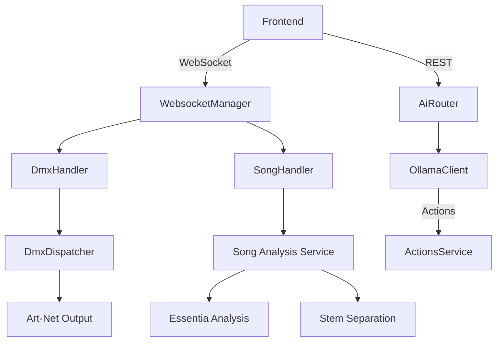

# AI Light Show Architecture Documentation

## Core Services

### 1. AI Integration Service
- **Components**: 
  - `ollama_client.py`: Handles AI model interactions
  - `ai_router.py`: REST endpoints for AI operations
- **Key Endpoints**:
  ```python
  @router.post("/chat")  # AI chat interface
  @router.get("/current-context")  # System state snapshot
  @router.post("/confirm-action")  # Action execution
  ```

### 2. Song Management Service
- **Components**:
  - `songs.py`: Song data persistence
  - `song_metadata.py`: Data model
- **Data Flow**:
  `Frontend → POST /songs/save → songs.py → SONGS_DIR`

### 3. WebSocket Service
- **Components**:
  - `websocket.py`: Connection handler
  - `websocket_manager.py`: Message routing
- **Protocol**:
  ```json
  {
    "type": "dmxUpdate|aiResponse|systemStatus|fixtureUpdate|songSync",
    "payload": {...}
  }
  ```

## API Reference

### AI Endpoints (api/ai)
| Endpoint | Method | Description |
|----------|--------|-------------|
| `/chat` | POST | Chat with lighting AI (returns action proposals) |
| `/current-context` | GET | Get current song/fixtures/presets |
| `/suggestions` | POST | Get song-section lighting suggestions |
| `/confirm-action` | POST | Execute confirmed lighting action |
| `/clear-conversation/{session_id}` | DELETE | Clear AI chat history |

**Example Request:**
```bash
curl -X POST "http://localhost:8000/api/ai/chat" \
  -H "Content-Type: application/json" \
  -d '{"message": "Create red wash for chorus", "session_id": "live-01"}'
```

### WebSocket Endpoints
| Path | Protocol | Message Types |
|------|----------|---------------|
| `/ws` | WS | dmxUpdate, aiResponse, systemStatus, fixtureUpdate, songSync |

**Message Handlers:**
| Handler | Message Types | Purpose |
|---------|---------------|---------|
| `ai_handler` | `userPrompt`, `confirmAction` | Processes AI chat requests and action confirmations |
| `dmx_handler` | `dmxUpdate`, `presetRecall` | Manages real-time DMX value updates and preset operations |
| `song_handler` | `loadSong`, `syncSongPosition` | Handles song loading and timeline synchronization |
| `sync_handler` | `requestFullSync` | Coordinates state synchronization between clients |

**Connection Flow Implementation** (websocket_manager.py):
1. On connection:
```python
await websocket.accept()
app_state.add_client(websocket)
```
2. Server sends initial `setup` payload with:
```python
{
    "type": "setup",
    "songs": app_state.get_songs_list(),
    "fixtures": app_state.fixture_config,
    "actions": []  # Loaded actions if available
}
```
3. Message handling via registered handlers:
```python
message_handlers = {
    "sync": handle_sync,
    "loadSong": handle_load_song,
    "setDmx": handle_set_dmx,
    "userPrompt": handle_user_prompt,
    # ...other handlers
}
```

## Frontend-Backend Integration

### Key Component Relationships


[Cross-reference with existing Fixtures documentation](./File_Fixtures.md)
[Cross-reference with existing SongMetadata documentation](./File_SongMetadata.md)

## IMPORTANT Fixtures and DMX Canvas understanding

### 🔌 Fixture Behavior Model
DMX fixtures are dumb devices — they do not understand commands like "strobe" or "flash". They only respond to raw channel values over time.

### 🎬 Action-to-Channel Translation
All high-level lighting instructions — referred to as actions (e.g. "strobe", "fade_in", "seek") — must be converted into sequences of channel values over time by the system.

✅ Example: strobe Action
If channel 10 controls the shutter:
"strobe" → [
  (t=0.00, channel 10 = 255),
  (t=0.10, channel 10 = 0),
  (t=0.20, channel 10 = 255),
  ...
]

The DMX canvas must be painted explicitly with the right values at the right timestamps to simulate the effect.

### 🧱 Implication
Lighting logic lives entirely in software. Fixtures are merely endpoints; the system is responsible for:
- Timing
- Value sequencing
- Effect shaping (e.g., ramping, pulsing, panning)

## AI Light show generation

| Step                                    | Role                                                   | Component                                     |
| --------------------------------------- | ------------------------------------------------------ | --------------------------------------------- |
| 1. **Audio Analysis**                   | Extract structure, stems, beats, chords, key moments   | `song_analysis/` service                      |
| 2. **Segment-Level Reasoning**          | Interpret musical intent, emotion, dynamics            | `Ollama` LLM via `/chat` or `/suggestions`    |
| 3. **Lighting Intent Chain-of-Thought** | Sequence the intent over time                          | AI via `/chat` or internal logic              |
| 4. **Generate DMX Actions**             | Convert lighting intents into fixture-specific actions | `actions_parser_service.py` and `ActionModel` |
| 5. **Render to Canvas**                 | Paint actions to timeline for playback                 | `ActionsService → DmxCanvas`                  |
